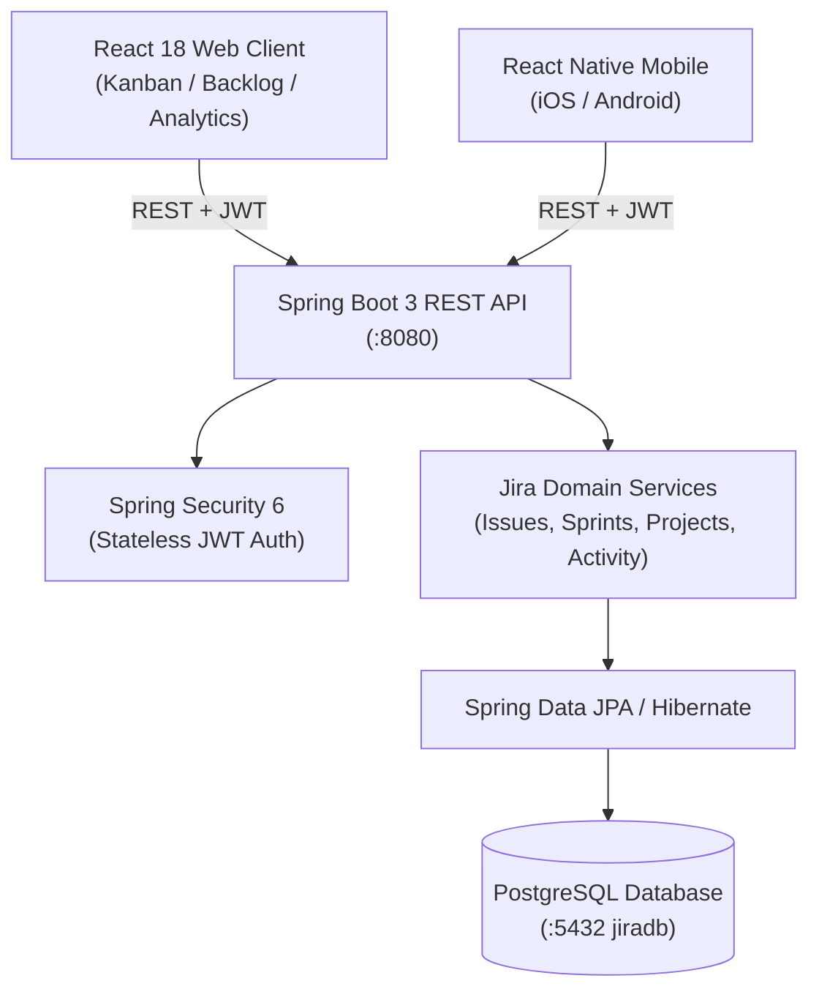

# Project Management 🚀
> Full-Stack Enterprise Project Management & Agile Task Workspace with Spring Boot 3, PostgreSQL, React Web & React Native Mobile.


-black)

---

## 📌 Architecture Overview



---

## 🔑 Key Features Implemented

1. **Authentication & Team Memberships**:
   - Stateless JWT tokens with Spring Security 6.
   - User roles: `ROLE_ADMIN`, `ROLE_PROJECT_LEAD`, `ROLE_MEMBER`, `ROLE_VIEWER`.
   - Granular project memberships & member assignment.

2. **Project & Workspace Management**:
   - Unique project keys (e.g. `CLOUD`, `PORTAL`).
   - Project leads and assigned team members.
   - Project settings and membership controls.

3. **Agile Issue & Task Management**:
   - Issue keys generated sequentially (`CLOUD-1`, `CLOUD-2`, etc.).
   - Issue Types: **Epic**, **Story**, **Task**, **Bug**, **Subtask**.
   - Priorities: **Highest**, **High**, **Medium**, **Low**, **Lowest**.
   - Workflow Statuses: **Backlog**, **To Do**, **In Progress**, **In Review**, **Done**.
   - Story points estimation, due dates, labels, and rich descriptions.

4. **Interactive Kanban Board**:
   - Drag & Drop status transitions between columns.
   - Instant optimistic UI state updates.
   - Filters: "Only My Issues", filter by Assignee avatar, Priority, and Issue Type.
   - Quick "+ Create Issue" button per column.

5. **Scrum Sprints & Backlog Planning**:
   - Active Sprint, Future Sprints, and Backlog views.
   - Drag/move issues between Backlog and Sprints.
   - Sprint lifecycle: **Start Sprint** and **Complete Sprint** (incomplete issues return to backlog).
   - Story points aggregate counter and sprint goals.

6. **Issue Detail Drawer & Collaboration**:
   - Live editable summaries and descriptions.
   - Dropdown status transitions with automatic audit trail logging.
   - Assignee selector with user avatars and search.
   - Real-time discussion comments (add, view, delete).
   - Activity History audit log (tracks who changed status, assignee, priority, or sprint).

7. **Project Dashboard & Velocity Metrics**:
   - Total issues, completion rate, and story points velocity.
   - Visual status breakdown and priority distribution charts.
   - Team workload balance showing issues assigned per member.

8. **Cross-Platform Mobile App (React Native CLI)**:
   - Full mobile parity: Kanban board, Backlog view, My Issues personal tab.
   - Status transitions, assignee picker, comments, and new issue creation.
   - Configurable host IP for iOS Simulator, Android Emulator, and physical devices.

---

## 👥 Pre-seeded Test Accounts

The backend automatically seeds these users, projects, sprints, and issues on first boot:

| Name | Role | Email | Password |
|---|---|---|---|
| **Alex Rivera** | Admin / Project Lead | `alex.admin@jira.dev` | `Password123!` |
| **Sarah Chen** | Product Lead | `sarah.lead@jira.dev` | `Password123!` |
| **David Miller** | Senior Developer | `david.dev@jira.dev` | `Password123!` |
| **Elena Rostova** | Lead QA | `elena.qa@jira.dev` | `Password123!` |

*(The web and mobile apps also feature **1-click quick login buttons** for instant testing!)*

---

## 🚀 Running the Project

### 1. Database (PostgreSQL)

You can run PostgreSQL via Docker or your local PostgreSQL service:

```bash
# Option A: Start PostgreSQL 16 & pgAdmin 4 with Docker Compose
docker-compose up -d

# Option B: Or use your local PostgreSQL 18
# Create database: createdb jiradb
```

### 2. Java Backend (Spring Boot 3)

The backend supports both PostgreSQL (production) and embedded H2 PostgreSQL mode (instant local dev):

```bash
cd backend

# Option A: Run with PostgreSQL (default)
mvn spring-boot:run

# Option B: Run with dev H2 in-memory profile (zero database setup needed)
mvn spring-boot:run -Dspring-boot.run.profiles=dev

# Or run the packaged JAR directly:
java -jar target/jira-backend-1.0.0.jar
```
The REST API is live at `http://localhost:8080`.

### 3. Frontend Web (React 18)

```bash
cd frontend-web
npm install
npm run dev
```
Open `http://localhost:3000` in your browser.

### 4. Mobile App (React Native CLI)

```bash
cd mobile
npm install

# Start Metro Bundler
npx react-native start

# Run on Android
npx react-native run-android

# Run on iOS (macOS only)
cd ios && pod install && cd ..
npx react-native run-ios
```
*(Tip: In the mobile app login screen, tap "Backend Server Settings" to configure the backend API host, e.g. `http://10.0.2.2:8080/api` for Android Emulator, `http://localhost:8080/api` for iOS Simulator, or your computer's local LAN IP `http://192.168.x.x:8080/api` for physical devices).*

---

## 📡 REST API Reference

| Method | Endpoint | Description |
|---|---|---|
| `POST` | `/api/auth/register` | Register new user |
| `POST` | `/api/auth/login` | Authenticate & get JWT token |
| `GET` | `/api/auth/me` | Get current logged in user |
| `GET` | `/api/projects` | List all user projects |
| `POST` | `/api/projects` | Create a new project |
| `POST` | `/api/projects/{id}/members/{userId}` | Add member to project |
| `GET` | `/api/projects/{id}/sprints` | List sprints for project |
| `POST` | `/api/sprints/{id}/start` | Start sprint |
| `POST` | `/api/sprints/{id}/complete` | Complete active sprint |
| `GET` | `/api/issues` | Filter issues by project, sprint, status, assignee |
| `POST` | `/api/issues` | Create new issue (generates sequential key e.g. `CLOUD-10`) |
| `PATCH` | `/api/issues/{id}/status` | Update issue status (creates audit log) |
| `PATCH` | `/api/issues/{id}/assign` | Update issue assignee (creates audit log) |
| `PATCH` | `/api/issues/{id}/move-sprint` | Move issue between backlog & sprints |
| `GET` | `/api/issues/{id}/comments` | Get discussion comments |
| `POST` | `/api/issues/{id}/comments` | Add comment to issue |
| `GET` | `/api/issues/{id}/activities` | Get audit activity history |
| `GET` | `/api/projects/{id}/dashboard` | Get project analytics & workload metrics |

---

## ☁️ Deploying to Render

This project includes a production `render.yaml` Blueprint that deploys:
1. **Managed PostgreSQL Database** (`jiradb`)
2. **Spring Boot Backend** (`jira-backend` Docker web service connected to PostgreSQL)
3. **React Web Frontend** (`jira-web` static site)

### Deployment Steps:
1. Push this repository to your **GitHub** account.
2. Log into the [Render Dashboard](https://dashboard.render.com).
3. Click **New +** → **Blueprint**.
4. Connect your GitHub repository.
5. Render reads `render.yaml` and will automatically provision:
   - The PostgreSQL instance
   - The Spring Boot Docker container with database credentials auto-linked
   - The React Web static site
6. Click **Apply** to launch!
